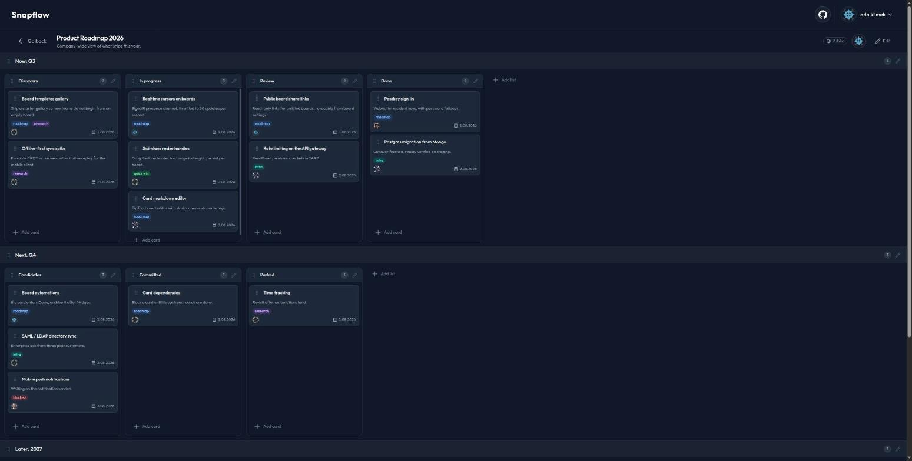
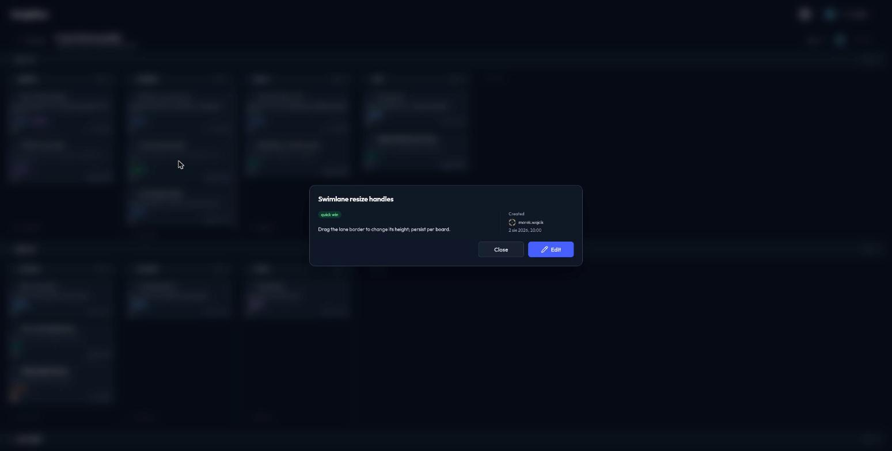
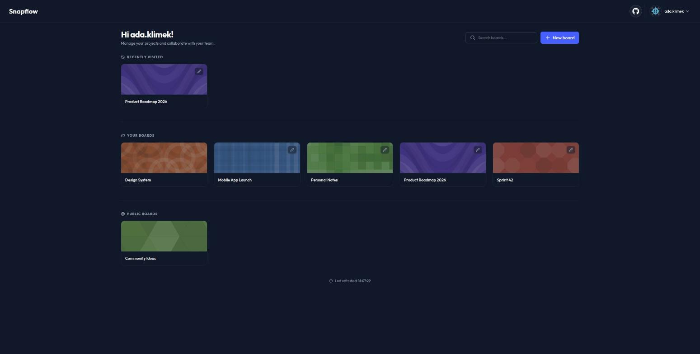
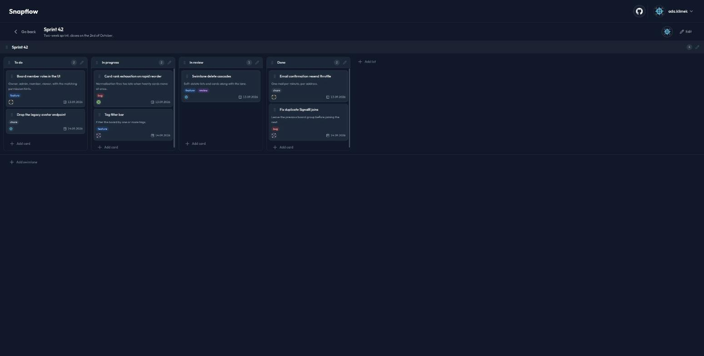
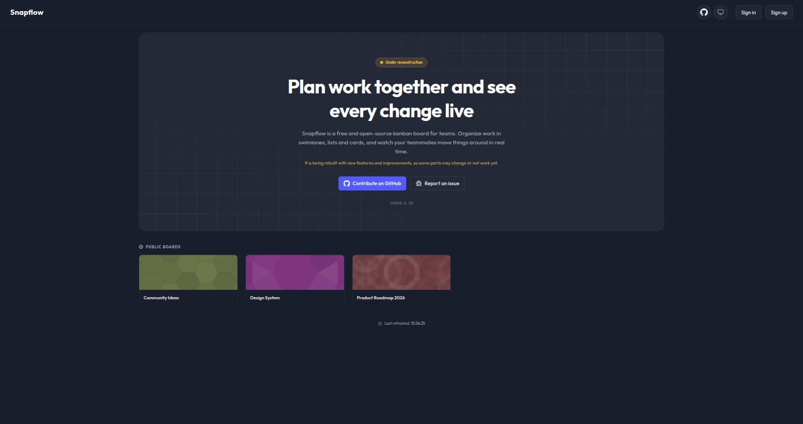
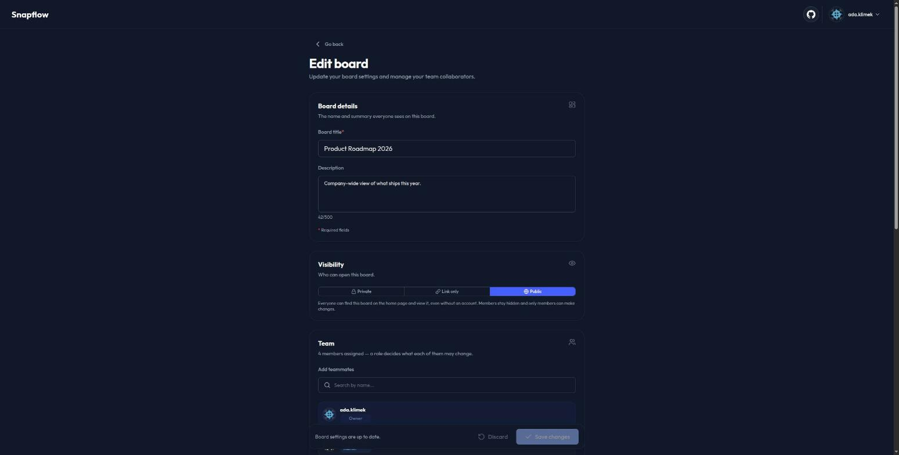

[](https://github.com/Pandetthe/Snapflow/blob/main/LICENSE)
[](https://github.com/Pandetthe/Snapflow/releases)
[](https://github.com/Pandetthe/Snapflow/actions/workflows/build-and-test.yml)
[](https://github.com/Pandetthe/Snapflow/actions/workflows/security.yml)

# Snapflow

Snapflow is a free and open source kanban board for teams. Work is organized in
swimlanes, lists and cards, and every change is pushed over SignalR to everyone
viewing the board.

**Snapflow is still under construction.** It is not ready for production use: features
are incomplete, and the database schema and the HTTP API change without notice. An
older version that runs on its own lives on the
[proof-of-concept branch](https://github.com/Pandetthe/Snapflow/tree/proof-of-concept).

|  |  |
| :-: | :-: |
|  |  |
|  |  |
|  |  |

## Development

Requires the .NET SDK pinned in [`global.json`](global.json), Node 24, and a container
runtime Aspire can drive.

```sh
npm ci --prefix web
dotnet run --project deployment/AppHost/AppHost.csproj
```

The Aspire dashboard prints a URL for every resource. Open the gateway to reach the
app: it serves the web client at `/` and proxies the API under `/api`, which in
development also exposes an OpenAPI document and a Scalar reference.

```sh
dotnet test ./server/Snapflow.slnx
npm run lint --prefix web && npm run check --prefix web && npm run test:unit --prefix web
```

Architecture tests enforce the clean architecture layering and the CQRS conventions.
`server/templates/` holds `dotnet new` templates that follow them.

C# formatting follows [`.editorconfig`](.editorconfig) and is applied by `dotnet format`.
A pre-commit hook that formats the staged `.cs` files ships in `.git-hooks/`, so point
git at it once per clone:

```sh
git config core.hooksPath .git-hooks
```

To format the whole solution by hand, or to check it without writing changes:

```sh
dotnet format ./server/Snapflow.slnx
dotnet format ./server/Snapflow.slnx --verify-no-changes
```

## Contribute

Code contributions are welcome! Please commit any pull requests against the main branch.

Security audits and feedback are welcome. Please open an issue or email us privately if the report is sensitive in nature. You can read our security policy in the SECURITY.md file.